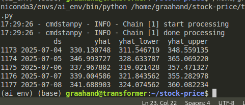

# STOCK PRICE PREDICTION (PREDICTION AND ANALYSIS)

### model prediction 
    Next day’s Close price (Predicting the exact closing price for next day) (prediction)
    Price movement direction (up/down) (classification)

With Open, High, Low, Close, Percent Change, and Volume is sufficient to compute a wide range of technical indicators like MACD, Bollinger Bands, RSI, Momentum, and more. Adding these derived features will enrich model’s input space and likely enhance prediction performance.

LSTM/DECISION TREE, DATA AUGMENTATION (if possible)

VERY SMALL LLM FOR ANALYSIS AND DESCRITION (OPTIONAL)

chrono-bolts model requires dataset in following format: 

1. item_id (name of company alternatively [symbol])
2. timestamp (date in this format [yyyy-mm-dd], iso format)
3. target (closing price) (opening, high, low is not required)

need to merge the dataset of all companies into single dataset where the item_id will be the unique identifier for each stock's prices. 

chrono-bolts models are provided by amazon and have been pre-trained with around 100 billions time-series data and very good at zero-shot prediction as well. 

prophet(facebook ai research), time series forecasting [for forecasting time series data based on an additive model where non-linear trends are fit with yearly, weekly, and daily seasonality, plus holiday effects]
    

    process:

    rename the timestamp as ds
    rename the closing price as y

    code:
    

    